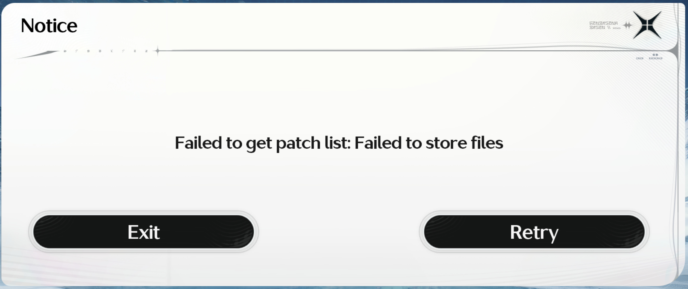
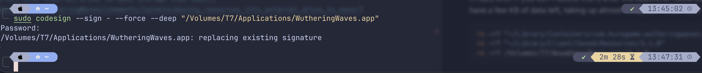

# 在 macOS 上把鳴潮移到外接硬碟

[English](./README.md) | [繁體中文](./README.zh-TW.md)

## 摘要

- 鳴潮版本：`3.2.0`
- macOS 版本：`26.4 (25E246)`
- 外接硬碟：`Samsung T7 1TB`

```text
T7
├── Applications
│   └── WutheringWaves.app
│       └── Contents
│           ├── _CodeSignature
│           ├── _MASReceipt
│           ├── Frameworks
│           └── ...
└── WuwaData
    └── Resources
        ├── 3.1.0
        │   ├── Diff
        │   ├── Launcher
        │   │   └── 3.1.17
        │   ├── Mount
        │   ├── ResManifest
        │   └── Resource
        │       └── 3.1.18
        └── 3.2.0
            ├── Launcher
            │   └── 3.2.8
            ├── Mount
            ├── ResManifest
            └── Resource
                ├── 3.2.10
                └── Base (downloading...)
```

遊戲會使用兩個資源路徑：

1. `~/Library/Containers/com.kurogame.wutheringwaves.global/Data/Library/Client/Saved/Resources/3.2.0`
2. `~/Library/Client/Saved/Resources/3.2.0`

> [!note]
> 一開始鳴潮通常會先下載額外資源到第一個路徑，如果發現該目錄有 symlink 則會要出現儲存錯誤。此時必須進行 codesign，再次開啟遊戲會將資源下載到第二個路徑，所以兩個目錄都要建立 symlink 才能確保遊戲資源正確下載到外接硬碟。

> [!caution]
> 內建硬碟要有足夠的空間才能啟動下載動作，大概80GB。或許可以嘗試修改影碟空間大小，欺騙鳴潮的空間檢測。

## 完整步驟

### Step 0：先完全關掉遊戲

先關掉：

- 鳴潮
- 任何還在下載的程序

不要在遊戲下載途中修改 symlink。

### Step 1：建立外接 SSD 目的資料夾

先建立外接硬碟上的目標路徑：

```shell
mkdir -p "/Volumes/T7/WuwaData/Resources/3.2.0"
```

這個資料夾就是之後真正存放資源的位置。

如果本機已經下載了一部分資料，請先刪除或搬移到 T7。

### Step 2：把第一個入口改成 symlink

先刪除本機原本的 `3.2.0` 或搬到 T7：

```shell
rm -rf "~/Library/Containers/com.kurogame.wutheringwaves.global/Data/Library/Client/Saved/Resources/3.2.0"
```

```shell
mv "~/Library/Containers/com.kurogame.wutheringwaves.global/Data/Library/Client/Saved/Resources/3.2.0" "/Volumes/T7/WuwaData/Resources/3.2.0"
```

再建立連結：

```shell
ln -s "/Volumes/T7/WuwaData/Resources/3.2.0" "~/Library/Containers/com.kurogame.wutheringwaves.global/Data/Library/Client/Saved/Resources/3.2.0"
```

### Step 3：把第二個入口也改成 symlink

先刪除本機原本的 `3.2.0`：

```shell
rm -rf "~/Library/Client/Saved/Resources/3.2.0"
```

再建立連結：

```shell
ln -s "/Volumes/T7/WuwaData/Resources/3.2.0" "~/Library/Client/Saved/Resources/3.2.0"
```

### Step 4：檢查兩條路徑是否都正確

執行：

```shell
ls -l "~/Library/Containers/com.kurogame.wutheringwaves.global/Data/Library/Client/Saved/Resources/3.2.0"
```

```shell
ls -l "~/Library/Client/Saved/Resources/3.2.0"
```

理想結果會像：

```shell
$ ls -l
total 0
lrwxr-xr-x@ 1 yuva  staff   36 Feb 13 14:41 3.1.0 -> /Volumes/T7/WuwaData/Resources/3.1.0
lrwxr-xr-x@ 1 yuva  staff   36 Mar 29 04:02 3.2.0 -> /Volumes/T7/WuwaData/Resources/3.2.0
```

只要兩邊都指向同一個外接資料夾就正確。

### Step 5：重新開遊戲繼續下載

重新啟動遊戲。

不論它走：

- `~/Library/Containers/.../3.2.0`
- `~/Library/Client/.../3.2.0`

最後都應該寫到：

`/Volumes/T7/WuwaData/Resources/3.2.0`

### Step 6：確認真的下載到 T7

在 Finder 直接打開：

`/Volumes/T7/WuwaData/Resources/3.2.0`

或是

```shell
cd "/Volumes/T7/WuwaData/Resources/3.2.0"
du -hd 1 | sort -hr
```

如果檔案持續增加，代表已成功下載到外接 SSD。

### 判斷是否成功

開啟鳴潮後如果出現以下兩個請求，通常表示設定成功：


### Codesign



如果進入遊戲時出現像 `Failed to get patch list: Failed to store files` 的啟動錯誤，可嘗試：

```shell
sudo codesign --sign - --force --deep "/Volumes/T7/Applications/WutheringWaves.app"
```

這步驟會花一段時間，在 mba m4 大約需要 2.5 分鐘。



這裡的路徑是因為透過 App Store 安裝到外接硬碟：

`/Volumes/T7/Applications/WutheringWaves.app`

如果你是安裝在內建硬碟，通常會是：

`/Applications/WutheringWaves.app`

如果遊戲本來就能開，只有資源下載路徑問題，可略過這一步。

### 清除舊資料

如果已經開始下載額外資源，上一個版本的資料也不再重要，可以刪除檔案和對應的 symlink，釋放 Mac 可憐的內建儲存空間。

實際上就算不刪除，最後額外資源下載完後，上一個版本的資料夾也會只剩下幾 KB 的資料，不佔空間，但如果想徹底清除，可以執行：

```shell
rm -rf "~/Library/Containers/com.kurogame.wutheringwaves.global/Data/Library/Client/Saved/Resources/3.1.0"
rm -rf "~/Library/Client/Saved/Resources/3.1.0"
rm -rf /Volumes/T7/WuwaData/Resources/3.1.0
```

## 參考資料

1. [Moving Resources Into External Drive to Save Storage (Mac Case)](https://www.reddit.com/r/WutheringWaves/comments/1q16kio/moving_resources_into_external_drive_to_save/)
